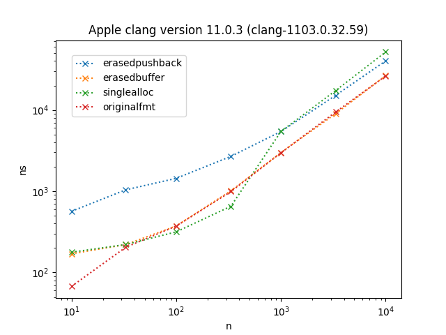

### fmt-code-size-experiments
Experiments for using fmt with a custom string library with the goal of minimal code size overhead for the consumers of the custom string library and reasonable performance. The underlying assumption is that there are many executables running which use the custom string library, therefore having some code in the shared custom string library instead of in every executable saves quite a bit of code size.

A dummy custom string is used here which is just a `std::vector<char>`.

The Dockerfile serves to determine code sizes on linux using gcc 9, it can be run right from the root directory: ```docker build . --tag=fmt-code-size-experiments```. It omits the microbenchmarks.

The baseline for using `fmt` with a custom string class is the library `usefmt_directpushback` which is only a header. The other `usefmt_` libraries all try to get the code into a shared library. For the `fmt` family of functions the code size overhead when using `fmt_directpushback` is about 1.6K, but for the `printf`-style functions it is about 45K.

| `usefmt` variant          | description   |
| --------------------------|---------------|
| usefmt_originalfmt        | just a using declaration for the functions in the `fmt` library, creates `std::string` instead of the custom string, for comparison |
| usefmt_directpushback     | directly call `push_back` on the custom string in a header |
| usefmt_erasedpushback     | use the type-erased `fmt::vformat_to` and `fmt::basic_printf_context` which get a `std::back_inserter` of the custom string, the actual formatting functions end up in the shared library |
| usefmt_erasedbuffer       | similar to `usefmt_erasedpushback` but use the `fmt` functions targetting a temporary `fmt::memory_buffer`, then construct the custom string from the `memory_buffer` |
| usefmt_singlealloc | use `fmt::format_to_n` to a fixed-size buffer first, if the fixed capacity is not sufficient then reserve sufficient capacity in the custom string before formatting into the custom string |
| usefmt_bufxyz | use a simple custom-made replacement for `fmt::memory_buffer` with configurable initial capacity to check the dependene on the initial capacity |

## performance

The summary is: `usefmt_erasedbuffer` is the way to go. Although this always results in a copy from the internal buffer to the custom string using a fixed-size buffer on the stack (as in `usefmt_singlealloc`) apparently isn't worth it.

# format a small string into a string of size n

The performance characteristics of `fmt::format` and `fmt::printf` are rather different for reasons I don't yet understand.

`fmt::format`


`fmt::printf`




